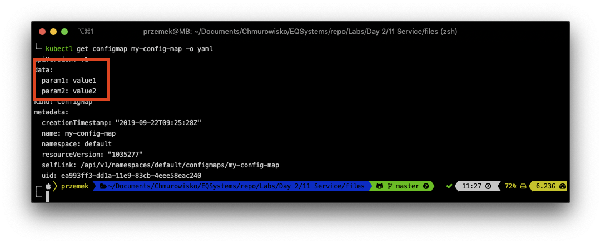
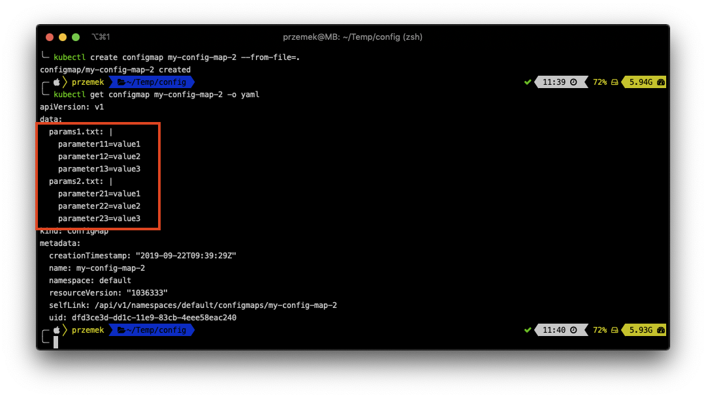
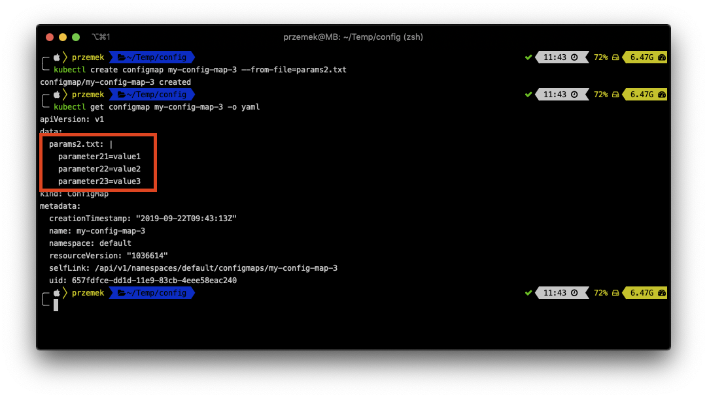
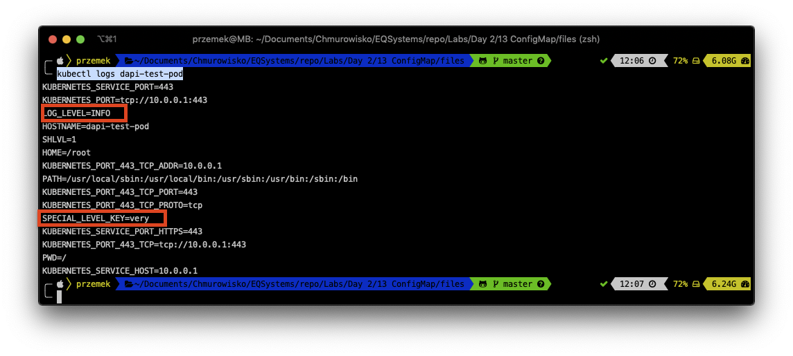

<br><br>
<br><br>
<br><br>

# ConfigMaps

## LAB Overview
In this lab you will work with ConfigMaps.

ConfigMaps are used to pro‐ vide configuration information for workloads. This can either be fine-grained infor‐ mation (a short string) or a composite value in the form of a file.

## Task 1: Creating a ConfigMap from literal

1. Run following command to create a simple ConfigMap from literal:
   ```bash
   kubectl create configmap my-config-map --from-literal=param1=value1 --from-literal=param2=value2
   ```
1. Get the config map using:
   ```bash
   kubectl get configmap my-config-map -o yaml
   ```
    

## Task2: Creating a ConfigMap from directories and files

1. Create a new directory `mkdir config` and enter it `cd config`
1. Create two paremeter files running:
   ```bash
   cat <<EOT >> params1.txt
   parameter11=value1
   parameter12=value2
   parameter13=value3
   EOT
   ```
   and
   ```bash
   cat <<EOT >> params2.txt
   parameter21=value1
   parameter22=value2
   parameter23=value3
   EOT
   ```
1. Still in the *config* directory run: 
   ```bash
   kubectl create configmap my-config-map-2 --from-file=.
   ```
   and check the ConfigMap:`kubectl get configmap my-config-map-2 -o yaml`
   

   You can also create a ConfigMap from one file.

1. Run 
   ```bash 
   kubectl create configmap my-config-map-3 --from-file=params2.txt
   ```
   and check the ConfigMap 
   ```bash
   kubectl get configmap my-config-map-3 -o yaml
   ```
   

## Task 3: Creating ConfigMap using Manifest File

1. Create a new file by running `nano cm.yaml`.
1. Download [manifest file](./files/cm.yaml) and paste its contents to editor window.
1. Save changes by pressing *CTRL+O* and *CTRL-X*.
1. Create ConfigMap by running: 
   ```bash
   kubectl apply -f cm.yaml
   ```

## Task 4: Using ConfigMap as container environment variables.
You will create a Pod with two environment variables.

1. Create a new file by running `nano pod.yaml`.
1. Download [manifest file](./files/pod.yaml) and paste its contents to editor window.
1. Save changes by pressing *CTRL+O* and *CTRL-X*.
1. Create a Pod by running: 
   ```bash
   kubectl apply -f pod.yaml
   ```
The Pod echoed its env variables.

1. Check the logs of the Pod: 
   ```bash
   kubectl logs dapi-test-pod
   ``` 
   and you should see two env variables defined in your config maps.
    

2. Delete the pod: 
   ```bash
   kubectl delete pod dapi-test-pod
   ```

## END LAB

<br><br>

<center><p>&copy; 2021 Chmurowisko Sp. z o.o.<p></center>
